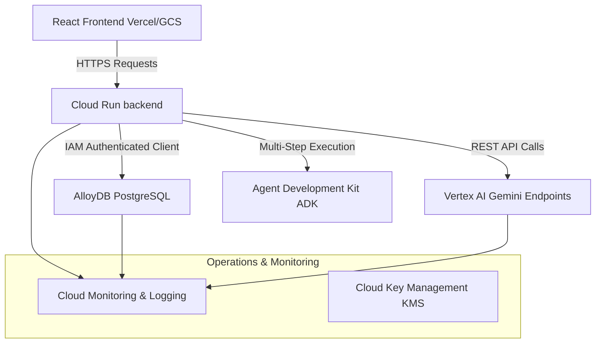

# SmartHub Production Architecture & Cloud Migration Path

This document outlines the architectural path to transition the Vadodara Digital Twin console from a local mock prototype to a resilient, enterprise-grade cloud system on Google Cloud Platform (GCP).

---

## 🏛️ Production System Architecture

---

## 🚀 Key Migration Paths

### 1. Database Layer: Flat-file `db.json` to AlloyDB for PostgreSQL
* **Migration Strategy**: Transition all database calls in the backend from asynchronous file reading/writing of `db.json` to PostgreSQL queries using an ORM like Prisma or Sequelize. Deploy **AlloyDB** as the highly available municipal data ledger. Use the `pgvector` extension to store chunked operational manuals and telemetry logs directly inside the database for Retrieval-Augmented Generation (RAG).
* **Rationale (Scalability & Reliability)**: Migrating to AlloyDB replaces the single-threaded file-locking model of `db.json` with transactional consistency (ACID), automatic failover, and high availability (99.99% SLA). AlloyDB's columnar engine enables real-time analytical queries over millions of IoT telemetry points, while its vector support guarantees faster and more secure RAG retrieval without needing an external vector database.

### 2. Computing Host: Local Node process to Google Cloud Run
* **Migration Strategy**: Containerize the Express backend using a minimal Dockerfile and push the image to Google Artifact Registry. Deploy the container onto **Google Cloud Run**, configuring Environment Variables (such as API keys, port configurations, and database credentials) using Google Secret Manager.
* **Rationale (Scalability & Observability)**: Cloud Run offers fully managed serverless hosting that automatically scales containers to zero during quiet hours (saving costs) and scales up horizontally to meet heavy traffic loads during rush-hour traffic peaks. It integrates natively with Google Cloud Logging and Cloud Monitoring, providing out-of-the-box dashboards for request latencies, CPU utilization, and system error rates.

### 3. Machine Learning Platform: Direct Gemini SDK to Vertex AI Endpoints
* **Migration Strategy**: Replace direct `@google/generative-ai` library initializations with the `@google-cloud/vertexai` SDK. Register and call the Vertex AI-managed Gemini model endpoints (e.g. `gemini-1.5-flash` or `gemini-1.5-pro`) hosted in your GCP project.
* **Rationale (Reliability & Observability)**: Calling models through Vertex AI endpoints provides enterprise-grade reliability, dedicated resource quotas, and model versioning controls to protect against breaking changes in model updates. It offers built-in monitoring for model drift, token consumption, response latencies, and request audits, ensuring full observability into LLM costs and security compliance.

### 4. Policy Orchestration: Telemetry Evaluators to Agent Development Kit (ADK)
* **Migration Strategy**: Transition the custom code-based rule evaluators in `server.js` to the **Agent Development Kit (ADK)** framework. Configure specialized, autonomous subagents (e.g., an Energy Grid subagent, a Mobility Detour subagent, and a Citizen Dispatch subagent) that use defined tool calls to inspect AlloyDB records and trigger actions.
* **Rationale (Reliability & Scalability)**: Using the ADK framework transitions the automation system from static, single-condition checks to a robust multi-step orchestrator capable of managing complex state machines and retrying failed dispatches. This ensures high reliability during cascading emergency incidents (e.g. resolving a grid overload while coordinating EV dispatches) and allows developer teams to write and scale agent actions independently.
